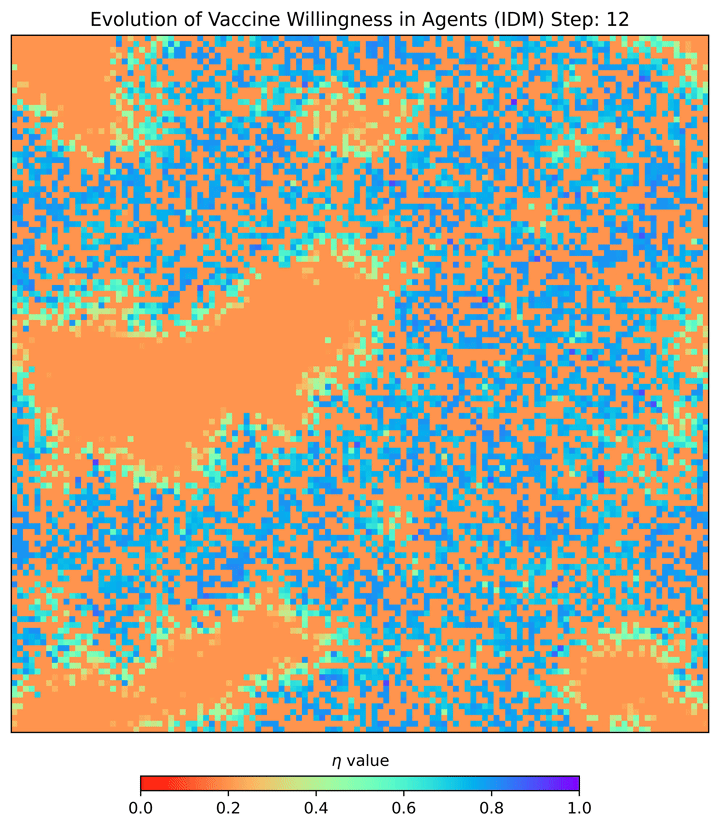

# Game-Theoretic-Disease-Spread-Simulation

## Overview
This repository features a simulation framework for modeling disease spread utilizing game theory to understand decision-making processes in infectious disease transmission. 

## Features
- **Disease Spread Simulation**: Leveraging game theory for nuanced behavioral modeling.
- **Visualization Tools**: Generate line graphs and heatmaps to visualize simulation results.
- **Customizable Parameters**: Tailor simulation inputs through a dedicated JSON file.



## Getting Started

### Prerequisites
- Python 3.11
- matplotlib
- numpy
- mesa == 1.2.1 
- networkx
- seaborn
- streamlit

### Installation and Setup
1. **Clone the Repository**
2. **Environment Setup with Nix**
   - Install Nix and run `nix develop --impure` in the project directory.

```bash
git clone git@github.com:mushrafi88/Game-Theoretic-Disease-Spread-Simulation.git
cd Game-Theoretic-Disease-Spread-Simulation
nix develop --impure
devenv up
```
for more instructions on how to setup devenv with nix follow this (https://devenv.sh/getting-started)

### Running the Simulation
- **Line Graphs and Simulations**: Run `python main.py` to initiate simulations and generate line graphs.
- **Web Interface**: Run `streamlit run app_streamlit.py`
- **Heatmaps**: Use `python heatmap.py` for heatmap visualizations.

### Customization
- Edit `parameters/parameters.json` to adjust simulation parameters.

## License
This project is under the MIT License.

## Acknowledgements
Inspired by epidemiological research and game theory.
